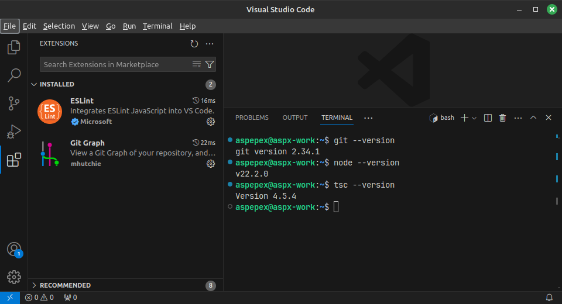

# L00_Prerequisites

## Installation

Download and install the following software packages on your machine.

- [Git](http://www.git-scm.com/)
- [node.js](https://nodejs.org/)
- [TypeScript Compiler (tsc)](https://www.typescriptlang.org/)
- [Visual Studio Code (VSC)](https://code.visualstudio.com/)
- Visual Studio Code Extensions
  - [ESLint](https://marketplace.visualstudio.com/items?itemName=dbaeumer.vscode-eslint)
  - [Git Graph](https://marketplace.visualstudio.com/items?itemName=mhutchie.git-graph)

## Testing

To see if everything is installed properly, perform the following tests:

- Open a Console/Terminal/Command-line window.
  - Type `git --version`. The result should be something like `git version 2.34.1`.
  - Type `node --version`. The result should be something like `v20.14.0`.
  - Type `tsc --version`. The result should be something like `Version 4.5.4`.
- Start Visual Studio Code and select the **View->Extension**. It should look something like the following image. 

## What?

- What find out what the different software might be used for.
